# Offline Speech Assistant MWE (EN) - File Input, CPU/GPU

Audio -> STT -> LLM -> TTS, mostly offline. The only network-like dependency is the local Ollama HTTP API, and Ollama model downloads happen outside this script.

Input comes either from pre-recorded English audio files or from a live microphone. The three pipeline stages run as concurrent workers and stream into each other, so the TTS starts on the first sentence while the LLM is still generating the rest. The script writes response WAVs and logs latency plus best-effort CPU/RAM/GPU statistics.

## Features

- Configuration via YAML files (`--config`) or CLI arguments
- Logs conversation transcripts (STT and LLM text) to `transcripts.jsonl` and `transcripts.yaml`
- Saves the exact runtime configuration to `config_used.yaml`
- File input via `--audio file1.wav file2.mp3 ...`, or live capture via `--input-mode mic`
- File input can be paced at 1x speed (`--audio-pacing realtime`) so that STT overlaps with the speech exactly as it would on a microphone — this is what makes file-based latency numbers carry over to a live deployment
- Concurrent STT / LLM / TTS workers; a new utterance can interrupt an answer still being generated
- English-only STT prompt flow and English TTS defaults
- Selectable STT engine: `--stt-engine vosk` or `--stt-engine whisper`
- Selectable TTS engine: `--tts-engine piper` or `--tts-engine coqui`
- CPU/GPU preset via `--mode cpu|gpu`
- Whisper can run on CPU or CUDA via `--whisper-device cpu|cuda`
- Input audio is normalized to mono 16 kHz WAV using `ffmpeg`
- Per-stage timing: `stt`, `stt_endpoint_delay`, `llm_ttft`, `llm_first_chunk_fill`, `llm_ttfc`, `tts_first_chunk`, `llm_eval`, `tts_total`
- `ttfa`: time from the speaker stopping to the first audio out — the figure a user actually perceives
- `e2e_response_ready`: wall-clock span of the whole item
- Best-effort resource stats in CSV: CPU %, RAM %, process RSS, and NVIDIA GPU utilization/memory when available

## Requirements

Common:

- Python 3.10
- `ffmpeg` on PATH
- Ollama running locally, for example `ollama serve`
- A pulled Ollama model, for example `ollama pull phi3:mini`

CPU package setup:

```bash
pip install -r requirements_cpu.txt
```

GPU package setup:

```bash
pip install -r requirements_gpu.txt
```

Additional assets:

- For Vosk: an English model, for example `vosk-model-small-en-us-0.15`
- For Piper: an English voice, for example `en_US-lessac-medium.onnx`
- For Coqui XTTS-v2: the model is loaded through the `TTS` package
- For GPU stats: `nvidia-smi` must be available
- System prompts: `prompts/*.txt`, referenced by `system-prompt-file`. These are
  local and not version controlled, so prompt wording can be iterated on freely.
  Without a prompt file the built-in default applies. The prompt actually used is copied to `<out-dir>/system_prompt.txt`, headed by its file name, so a
  measurement stays identifiable.

## Examples

Whisper on CPU with Piper:

```bash
python mwe_assistant.py --audio .\sample_en.wav ^
  --mode cpu ^
  --stt-engine whisper ^
  --whisper-device cpu ^
  --whisper-model small ^
  --whisper-compute-type int8 ^
  --tts-engine piper ^
  --piper-exe .\piper\piper.exe ^
  --piper-voice .\piper\en_US-lessac-medium.onnx ^
  --ollama-model phi3:mini
```

Vosk on CPU with Piper:

```bash
python mwe_assistant.py --audio .\sample_en.wav ^
  --mode cpu ^
  --stt-engine vosk ^
  --vosk-model .\vosk-model-small-en-us-0.15 ^
  --tts-engine piper ^
  --piper-exe .\piper\piper.exe ^
  --piper-voice .\piper\en_US-lessac-medium.onnx
```

Whisper on CUDA with Coqui:

```bash
python mwe_assistant.py --audio .\sample_en.wav ^
  --mode gpu ^
  --stt-engine whisper ^
  --whisper-device cuda ^
  --whisper-model medium ^
  --whisper-compute-type float16 ^
  --tts-engine coqui ^
  --coqui-language en ^
  --coqui-speaker "Daisy Studious"
```

Multiple files:

```bash
python mwe_assistant.py --audio .\a.wav .\b.mp3 .\c.flac --stt-engine whisper --tts-engine piper
```

## Important Arguments

- `--config PATH`: optional; path to a YAML configuration file (CLI arguments override YAML values)
- `--audio PATH [PATH ...]`: required (unless provided in config); one or more input files
- `--mode {cpu,gpu}`: default device preset
- `--stt-engine {vosk,whisper}`: speech-to-text engine
- `--tts-engine {piper,coqui}`: text-to-speech engine
- `--out-dir DIR`: base output directory, default `outputs`
- `--latency-csv PATH`: custom CSV path
- `--keep-normalized`: keep the intermediate mono 16 kHz WAV files

Input and pacing:

- `--input-mode {file,mic}`: file input or live capture, default `file`
- `--audio-pacing {realtime,fast}`: how file input is fed to the STT, default `realtime`. `realtime` delivers at 1x speed like a microphone and is required for `ttfa`; `fast` reads as quickly as possible, which suits throughput runs and per-stage costs
- `--file-realtime-trigger {endpoint,end-of-file}`: what starts the LLM under file input with realtime pacing, default `endpoint`. See [Trailing silence in input files](#trailing-silence-in-input-files)
- `--audio-chunk-ms N`: chunk length handed to the STT, default `250`
- `--playback`: play the TTS output on speakers
- `--idle-timeout SECONDS`: silence before mic mode exits, default `10`

LLM and TTS behaviour:

- `--system-prompt-file PATH`: prompt variant; the one used is copied to `<out-dir>/system_prompt.txt`
- `--llm-temperature FLOAT`: sampling temperature, default `0` — greedy decoding, so a run repeats exactly. Raise it only with `--llm-seed` set
- `--llm-seed INT`: sampling seed, unset by default. It does nothing at temperature `0`, and is what keeps a run reproducible above it
- `--llm-max-tokens N`: response cap, default `150`
- `--tts-chunk-max-chars N`: safety-net chunk length for the LLM → TTS handoff, default `140`. Lower = lower TTFA, higher = better prosody

Engines:

- `--vosk-model PATH`: English Vosk model directory
- `--whisper-model NAME`: faster-whisper model name, default `small`
- `--whisper-device {cpu,cuda}`: explicit Whisper device
- `--whisper-compute-type TYPE`: for example `int8` on CPU or `float16` on CUDA
- `--piper-exe PATH`: Piper executable
- `--piper-voice PATH`: English Piper `.onnx` voice
- `--piper-use-exe`: call the Piper CLI instead of the Python API (slower, spawns a subprocess per chunk)
- `--coqui-voice NAME`: default `xtts_v2`
- `--coqui-language CODE`: default `en`
- `--coqui-speaker NAME`: default `Daisy Studious`
- `--ollama-model NAME`: default `phi3:mini`
- `--ollama-url URL`: default `http://localhost:11434/api/generate`

## Outputs

Each run creates `outputs/<YYYYMMDD_HHMMSS>/` containing:

- Copied input files as `user_input_<n>_<name>`
- Generated assistant responses as `assistant_<n>_<input-stem>.wav`
- `config_used.yaml`: The exact runtime configuration used for the run
- `transcripts.jsonl` and `transcripts.yaml`: Conversation logs containing the recognized STT text and the LLM response
- `latency_log_<timestamp>.csv`

The CSV contains:

- `stage`: one of `stt`, `stt_endpoint_delay`, `llm_prompt_eval`, `llm_ttft`, `llm_first_chunk_fill`, `llm_ttfc`, `tts_first_chunk`, `ttfa`, `llm_eval`, `tts_total`, `e2e_response_ready`
- `duration_ms`: stage duration in milliseconds
- `input_mode`, `audio_pacing`, `utterance_trigger`: how the audio reached the pipeline and what released it to the LLM. Which stages carry a value, and what they include, depends on these, so runs that differ in them must not be pooled. `utterance_trigger` records the behaviour that applied, not the setting that was requested.
- `cpu_percent`: average system-wide CPU load over the stage the row belongs to
- `ram_percent`, `rss_mb`: system RAM in use and this process's resident set, read at the moment the stage finished
- `gpu_util_percent`, `gpu_mem_used_mb`, `gpu_mem_total_mb`, `gpu_name`
- `extra_json`: additional metadata, including input duration and output path where relevant

### TTFA and the end of speech

`ttfa` is the headline latency figure: from the moment the speaker stopped to the first audio out. Everything hangs on locating that moment, which is neither the end of the file nor the point the STT finalizes:

- A recording carries silence past its last word.
- An endpointer has to hear that silence before it can decide the utterance is over, so a microphone keeps delivering audio the whole time it deliberates.

The anchor therefore comes from the STT's own word timings, which both engines report. `extra_json` on the `stt` row carries `trailing_silence_ms`, the gap between the last word and the end of the audio.

`stt_endpoint_delay` measures from the end of speech to the finished transcript. On file input that is the flush once the stream ends; on a microphone it is the endpointer waiting out the silence, which is usually the largest single component of what a user perceives.

Both stages are **blank under `fast` pacing**: the audio does not advance at wall-clock speed there, so no offset within it corresponds to an instant. Use `realtime` for any latency claim; `fast` remains useful for throughput and for the per-stage costs (`stt`, `llm_ttfc`, `tts_first_chunk`, `e2e_response_ready`), which stay valid.

### Trailing silence in input files

For `realtime` pacing to stand in for a microphone, input files need enough silence after the last word for the endpointer to fire — measured at roughly 1100 ms with `vosk-model-small-en-us-0.15`. Below that the engine only finalizes because the file ran out, a signal live input never gets, and the run reports an optimistic TTFA. A warning is printed when this happens.

How much more than that to allow depends on `file-realtime-trigger`:

| `file-realtime-trigger` | what starts the LLM | trailing silence to aim for |
|---|---|---|
| `endpoint` (default) | the STT calls the utterance over, as a microphone would | at least 1.2 s, with no upper bound |
| `end-of-file` | the whole file has been read | 1.2–1.5 s, and no more — silence past the endpoint is added to `ttfa` in full |

`stt_endpoint_delay` is unaffected either way and stays around 1100 ms however long the tail runs.

The setting applies only to file input with realtime pacing. Mic mode always triggers on the endpoint, having no stream end to wait for; `fast` pacing always waits for the file, where doing so costs nothing. It has no effect with Whisper, which has no endpointer and finalizes only when the stream ends.

Under `endpoint`, a second end-of-speech signal within one input carries **everything recognized so far**, not just the new sentence, and supersedes the answer already in flight. An endpointer that fires while the speaker is only drawing breath would otherwise have the LLM answer half a sentence. Note that this is not conversation memory: each request to Ollama is independent, carries no `context` and no message history, and the assistant's own previous replies are never fed back.

## Notes

- CPU/RAM stats require `psutil`; if unavailable, those fields stay blank.
- Resource columns are captured by the worker that owns the stage, at the moment that stage finishes. `psutil.cpu_percent(interval=None)` reports load since its own previous call and keeps that state per thread, so each stage opens its own measurement window with a priming call when it starts.
- A row's CPU window matches its `duration_ms` exactly for `stt`, `llm_ttft`, `llm_first_chunk_fill`, `tts_first_chunk` and `e2e_response_ready`. The rest are approximations: `llm_ttfc` is timed from the start of the request but its CPU window starts at the first token; `ttfa` reuses the `tts_first_chunk` snapshot and `stt_endpoint_delay` the `stt` one; `llm_prompt_eval` reuses the first-token snapshot, the nearest boundary to a phase that had already ended by the time Ollama reported it; `llm_eval` and `tts_total` carry the snapshot taken when their worker finished.
- GPU stats are read from `nvidia-smi`; if unavailable or no NVIDIA GPU is present, those fields stay blank. A background sampler refreshes them every second, which keeps the subprocess off the measured path. Fields the driver reports as `[N/A]` are stored blank so the numeric columns stay numeric.
- `e2e_response_ready` runs from the start of processing to the complete response, in every mode. On file input it therefore includes the delivery of the audio; on a microphone it covers the whole session. It is a wall-clock span, not a latency — for latency use `ttfa`.
- `stt_rtf` is `stt` divided by the audio duration. It expresses a real-time factor only under `fast` pacing. Under `realtime` pacing `stt` includes waiting for the audio to arrive, which puts the ratio above 1 and makes it a measure of something else.
- Response length varies enough between runs to hide whatever is under test: `llm_eval`, `tts_total` and `e2e_response_ready` all scale with it. The default `llm-temperature: 0` removes that variance, so a run repeats exactly; raising it needs an `llm-seed` to stay reproducible. `ttfa` and `stt_endpoint_delay` are unaffected either way, as both conclude before the response length is known.
- Greedy decoding is not how the model would be run in production, so absolute `llm_eval`, `tts_total` and `e2e_response_ready` figures are not a forecast of live behaviour — they are a stable baseline for comparing one configuration against another. Sampling at a realistic temperature, with a seed, is a separate experiment.
- Pinning either one only makes a run repeat for the *same* prompt. Two STT engines produce different transcripts, so the model receives different text and answers at different lengths — no seed makes the length-dependent stages comparable across engines.


# Metric Descriptions

## Timeline

Under `realtime` pacing or a live microphone. The two things that matter: the STT
works *while the speaker is still talking*, and TTFA starts when the speaker stops,
not when processing does.

Bar widths are schematic — chosen for legibility, not measured — and the axis carries
no units. What the diagram encodes is order and overlap.

```mermaid
gantt
    title Realtime pacing — what happens when
    dateFormat x
    axisFormat  
    todayMarker off

    section Audio in
    speech                       :done,    0,     3100
    trailing silence             :done,    3100,  4800

    section STT
    transcribe audio             :active,  0,     4800
    detect end of speech         :crit,    3100,  4200

    section LLM
    process prompt               :active,  4200,  4900
    generate first chunk         :active,  4900,  6100
    generate remaining chunks    :active,  6100,  8500

    section TTS
    synthesize first chunk       :active,  6100,  6700
    synthesize remaining chunks  :active,  6700,  9000

    section Reported
    time to first audio (TTFA)   :crit,    3100,  6700
    time to full response        :active,  0,     9000
```



Reading it against the CSV: the transcribe bar is `stt` and the one below it
`stt_endpoint_delay`; the first TTS bar is `tts_first_chunk`; the two reported rows
are `ttfa` and `e2e_response_ready`.

The first LLM bar is `llm_prompt_eval` and the pair together spans `llm_ttfc`. They
divide where the model stops reading and starts writing, which falls a little short
of where `llm_ttft` ends — that one runs on to the first token and also carries the
HTTP round trip.

Two consequences fall out of the shape:

- **`stt` is not part of TTFA.** Most of it happens before the speaker stops. Only
  what is left over — `stt_endpoint_delay` — lands on the critical path. This is the
  whole reason a streaming engine beats a buffering one on perceived latency.
- **`e2e_response_ready` and `ttfa` start at different instants**, so `e2e >= ttfa`
  holds for a different reason than it looks: `e2e` additionally contains the speech
  itself.

Under `fast` pacing the picture collapses — the audio is consumed up front, no point
inside it maps to a wall-clock instant, and `ttfa` and `stt_endpoint_delay` are not
recorded at all.

---

## CSV Stages

### `stt` – Speech-to-Text processing time

| | |
|---|---|
| **What it measures** | Wall-clock time in the STT worker, from its start to the finalized transcript. Under `fast` pacing that is the net decode cost. Under `realtime` pacing, or on a microphone, it also contains the wait for the audio to arrive, since the worker cannot outrun the speaker. |
| **Measurement point** | Before → after the transcription loop. |
| **duration_ms** | STT worker wall-clock time. |
| **extra_json** | `input_duration_ms` – length of input audio (ms); `stt_rtf` – `stt / input_duration` (a genuine real-time factor only under `fast` pacing; under `realtime` it exceeds 1 because the wait is included); `trailing_silence_ms` – gap between the last recognized word and the end of the audio. |

---

### `llm_ttfc` – LLM Time to First (synthesizable) Chunk

| | |
|---|---|
| **What it measures** | The time elapsed from starting the LLM request until the first synthesizable text chunk (sentence) arrives at the client side. Includes sending the HTTP request, Ollama server prompt processing, and the tokens of the first complete sentence. |
| **Measurement point** | Starting LLM streaming request → arrival of the first chunk from the generator. |
| **duration_ms** | Prompt → first sentence client-side latency. |
| **extra_json** | – |

---

### `tts_first_chunk` – TTS first chunk synthesis time

| | |
|---|---|
| **What it measures** | The time to convert the first LLM sentence into speech. This is the last component of TTFA: after this, the user would first hear a response. |
| **Measurement point** | Before → after the TTS function call (for the first chunk only). |
| **duration_ms** | TTS synthesis time of the first sentence. |
| **extra_json** | – |

---

### `ttfa` – Time to First Audio ⭐

| | |
|---|---|
| **What it measures** | The metric that matters from a user's perspective: how long they wait, after they stop talking, before hearing the first word back. |
| **Measurement point** | Directly measured, from the end of the speech to the first synthesized chunk being ready. The end of the speech comes from the STT's own word timings, not from the end of the file and not from the point the STT finalizes. |
| **duration_ms** | `tts_first_chunk_t − speech_end_t` |
| **extra_json** | – |
| **Blank when** | The instant is unknowable: `fast` pacing (no offset in the audio maps to a wall-clock time), or the engine reported no word timings. |

Decomposes as `stt_endpoint_delay + llm_ttfc + tts_first_chunk`, to within a few ms.
Note that `stt` is **not** a term: under realtime pacing most of it happens before
the speaker stops.

The anchor is only as good as the engine's timestamps. Against an independent
energy-based reference on the same audio, Vosk's last-word end runs ~57 ms late and
Whisper's last-segment end ~252 ms late — and a *later* anchor shortens the engine's
own `ttfa`. Comparisons across engines carry that bias.

---

### `stt_endpoint_delay` – End of speech to finished transcript

| | |
|---|---|
| **What it measures** | How long the STT took to decide the utterance was over and produce the text. On a live microphone this is the endpointer waiting out the trailing silence, usually the largest single component of what a user perceives. |
| **Measurement point** | End of speech (from word timings) → the finalized result arriving. |
| **duration_ms** | `stt_final_t − speech_end_t` |
| **extra_json** | – (shares the `stt` row's resource snapshot) |
| **Blank when** | Same conditions as `ttfa`. |

---

### `llm_prompt_eval` – Reading the prompt

| | |
|---|---|
| **What it measures** | Ollama evaluating the prompt — the system prompt, the framing and the recognized text — before it produces anything. Prefill covers every prompt token in a single parallel pass, which makes it far cheaper per token than generation, but it is paid in full on every request. |
| **Measurement point** | Server-side, read from Ollama's `done: true` message. Reported only once the whole response has finished, so it is known retroactively rather than observed as it happens. |
| **duration_ms** | `prompt_eval_duration` as reported by Ollama. |
| **extra_json** | `prompt_tokens` – size of the evaluated prompt; `system_prompt` – the prompt variant in use. |

Being server-side, this excludes the HTTP round trip, so it is shorter than
`llm_ttft` by that plus the first token's own generation. Shrinking the system prompt
shows up here first, and through it in `ttfa`.

**This figure is cache-sensitive.** Ollama keeps the previous request's KV cache and
reuses however much of the prompt is unchanged. Since the system prompt leads and
only the user's words differ, consecutive requests reuse nearly all of it, and a
repeated question reuses the lot. Warmup therefore sends the real framing rather than
an empty string, so the first utterance starts from the same cache state as every
later one instead of paying to evaluate the whole prompt. Two consequences when
reading the number: a run whose input repeats the same question will report values
far below what a fresh question costs, and a cold server reports several times the
warm figure.

---

### `llm_ttft` – LLM time to first token

| | |
|---|---|
| **What it measures** | Request sent → first token back. Covers the HTTP round trip and Ollama's prompt evaluation. |
| **Measurement point** | Start of the streaming request → first token from the generator. |
| **duration_ms** | Prompt → first token. |
| **extra_json** | – |

---

### `llm_first_chunk_fill` – First token to first speakable chunk

| | |
|---|---|
| **What it measures** | How long the chunker waited for enough text to be worth speaking, once the model had started producing tokens. This is the slice a short opening sentence is meant to remove. |
| **Measurement point** | Derived: `llm_ttfc − llm_ttft`. |
| **duration_ms** | First token → first chunk handed to the TTS. |
| **extra_json** | `first_chunk_chars` – length of that opening chunk; `system_prompt` – the prompt variant in use. |

---

### `llm_eval` – LLM server-side token generation time

| | |
|---|---|
| **What it measures** | The net token generation time (eval_duration) measured on the Ollama server. This is ground truth: it does not include network latency, client-side processing, or TTS time. |
| **Measurement point** | Read from Ollama's `done: true` message (server-side measurement). |
| **duration_ms** | Net token generation time on the server. |
| **extra_json** | `eval_tokens` – number of generated tokens; `tokens_per_sec` – generation speed (tok/s); `total_duration_ms` – total Ollama server-side time (load + prompt eval + eval + overhead). The prompt side has its own row, `llm_prompt_eval`. |

---

### `tts_total` – TTS total synthesis time

| | |
|---|---|
| **What it measures** | The sum of the synthesis times of all TTS chunks. Net TTS time, does not include LLM waiting or I/O. |
| **Measurement point** | Σ (Before → after TTS call) for every chunk. |
| **duration_ms** | Total TTS synthesis time. |
| **extra_json** | – |

---

### `e2e_response_ready` – End-to-End processing time

| | |
|---|---|
| **What it measures** | The wall-clock span of the whole item, from the start of processing to the complete response. One definition in every mode: on file input it therefore includes delivering the audio, and on a microphone it covers the entire session. A span, not a latency — for latency use `ttfa`. |
| **Measurement point** | `e2e_t0`, set before the workers start → after they have drained and the response WAVs are closed. |
| **duration_ms** | Whole-item wall-clock time. |
| **extra_json** | `input_duration_ms` – length of input audio; `output_duration_ms` – total length of the response audio; `output_wav` – path of the first generated WAV; `output_wav_count` – number of response WAVs (a mic session answers more than once); `full_text` – full text response of the LLM; `response_word_count`, `response_char_count` – size of the response; `llm_chunk_count` – number of sentence-level chunks. |

---

## Relationships Between Metrics

| Relationship | Always true? |
|-------------|-------------|
| `ttfa ≈ stt_endpoint_delay + llm_ttfc + tts_first_chunk` | ✅ To within a few ms |
| `ttfa` includes any part of `stt` | ❌ `stt` mostly runs while the speaker is still talking, so it is not on the TTFA path |
| `llm_ttfc = llm_ttft + llm_first_chunk_fill` | ✅ By definition — `llm_first_chunk_fill` is derived from the other two |
| `e2e >= ttfa` | ✅ But note they start at different instants: `e2e` runs from the start of processing, `ttfa` from the end of the speech, so `e2e` also contains the speech itself |
| `tts_total >= tts_first_chunk` | ✅ The total is the sum of all chunks |
| `llm_eval < total_duration_ms` (extra_json) | ✅ The total also includes prompt eval and overhead |
| `llm_ttfc >= llm_eval` | ❌ Not always! TTFC measures until the first sentence arrives, eval is the generation time of **all** tokens. For short responses TTFC ≈ eval; for long responses TTFC < eval. |
| `tokens_per_sec ≈ eval_tokens / (llm_eval / 1000)` | ✅ By definition |
| `stt_rtf = stt / input_duration_ms` | ✅ By definition — but only a real-time factor under `fast` pacing |
| `ttfa` and `stt_endpoint_delay` present | ❌ Only under `realtime` pacing or mic input, and only when the engine reports word timings |
