# Offline Speech Assistant MWE (EN) - File Input, CPU/GPU

Audio -> STT -> LLM -> TTS, mostly offline. The only network-like dependency is the local Ollama HTTP API, and Ollama model downloads happen outside this script.

Input comes either from pre-recorded English audio files or from a live microphone. The three pipeline stages run as concurrent workers and stream into each other, so the TTS starts on the first sentence while the LLM is still generating the rest. The script writes response WAVs and logs latency plus best-effort CPU/RAM/GPU statistics.

## Features

- Configuration via YAML files (`--config`) or CLI arguments
- Logs conversation transcripts to `transcripts.jsonl` and `transcripts.yaml`, carrying what the recording was supposed to say next to what the STT heard
- Saves the exact runtime configuration to `config_used.yaml`
- Aggregates its own latency log when the run finishes, so every run folder carries the distribution it measured and not just the raw rows (`--no-summary` opts out)
- File input via `--audio file1.wav file2.mp3 ...`, or live capture via `--input-mode mic`
- File input can be paced at 1x speed (`--audio-pacing realtime`) so that STT overlaps with the speech exactly as it would on a microphone — this is what makes file-based latency numbers carry over to a live deployment
- Concurrent STT / LLM / TTS workers; a new utterance can interrupt an answer still being generated
- English-only STT prompt flow and English TTS defaults
- Selectable STT engine: `--stt-engine vosk` or `--stt-engine whisper`
- Tunable Vosk endpointer via `--vosk-endpoint-silence-ms`, the largest single component of perceived latency; `vosk_endpoint_sweep.py` measures the setting against a corpus of recordings
- Selectable TTS engine: `--tts-engine piper` or `--tts-engine coqui`
- CPU/GPU preset via `--mode cpu|gpu`
- Whisper can run on CPU or CUDA via `--whisper-device cpu|cuda`
- Piper can run on CPU or CUDA via `--piper-device cpu|cuda`, which trades a per-call cost against a per-second-of-speech one and so helps long chunks and hurts short ones — see [Piper on the GPU](#piper-on-the-gpu)
- Coqui XTTS-v2 can run on CPU or CUDA via `--coqui-device cpu|cuda`, where the GPU is worth 4-5x and is effectively required — see [Coqui XTTS-v2](#coqui-xtts-v2)
- Input audio is normalized to mono 16 kHz WAV using `ffmpeg`
- Per-stage timing: `stt`, `stt_endpoint_delay`, `llm_ttft`, `llm_first_chunk_fill`, `llm_ttfc`, `tts_first_chunk`, `llm_eval`, `tts_total`
- `ttfa`: time from the speaker stopping to the first audio out — the figure a user actually perceives
- `e2e_response_ready`: wall-clock span of the whole item
- Best-effort resource stats in CSV: CPU %, RAM %, process RSS, and NVIDIA GPU utilization/memory when available
- The LLM is counted where it actually lives: the model sits in the Ollama server's runner process, not in this one, so its RAM and its VRAM are logged separately from the pipeline's own — see [What the LLM holds](#what-the-llm-holds)

## Requirements

Common:

- Python 3.10
- `ffmpeg` on PATH
- Ollama running locally, for example `ollama serve`
- A pulled Ollama model, for example `ollama pull phi3:mini`
- Only for `--input-mode mic` and `--playback`: the PortAudio library that
  `sounddevice` binds to (Debian/Ubuntu: `apt install libportaudio2`). File mode
  needs no audio device and runs on a headless server without it.

CPU package setup:

```bash
pip install -r requirements_cpu.txt
```

GPU package setup:

```bash
pip install -r requirements_gpu.txt
```

Additional assets:

- For Vosk: an English model, for example `vosk-model-small-en-us-0.15`
- For Piper: an English voice, for example `en_US-lessac-medium.onnx`
- Only for `--piper-device cuda`: an `onnxruntime-gpu` in place of the CPU
  `onnxruntime` that `piper-tts` installs, and one built for the GPU's compute
  capability. `requirements_gpu.txt` carries the commands and
  [Piper on the GPU](#piper-on-the-gpu) explains which versions a pre-Ampere
  card is limited to
- For Coqui XTTS-v2: the `coqui-tts` package, **not** the original `TTS`
  distribution, which caps at Python 3.11 and cannot be installed here. It needs
  a GPU to be usable and a PyTorch built for that GPU's compute capability;
  `requirements_gpu.txt` carries the commands and
  [Coqui XTTS-v2](#coqui-xtts-v2) the reasoning. The model is a 1.87 GB download
  under a non-commercial licence
- For GPU stats: an NVIDIA driver, read through `nvidia-ml-py` (in both requirements files) or, failing that, an `nvidia-smi` on PATH
- System prompts: `prompts/*.txt`, referenced by `system-prompt-file`. These are
  local and not version controlled, so prompt wording can be iterated on freely.
  Without a prompt file the built-in default applies. The prompt actually used is copied to `<out-dir>/system_prompt.txt`, headed by its file name, so a
  measurement stays identifiable.

## Examples

Whisper on CPU with Piper:

```bash
python mwe_assistant.py --audio .\sample_en.wav ^
  --mode cpu ^
  --stt-engine whisper ^
  --whisper-device cpu ^
  --whisper-model small ^
  --whisper-compute-type int8 ^
  --tts-engine piper ^
  --piper-exe .\piper\piper.exe ^
  --piper-voice .\piper\en_US-lessac-medium.onnx ^
  --ollama-model phi3:mini
```

Vosk on CPU with Piper:

```bash
python mwe_assistant.py --audio .\sample_en.wav ^
  --mode cpu ^
  --stt-engine vosk ^
  --vosk-model .\vosk-model-small-en-us-0.15 ^
  --tts-engine piper ^
  --piper-exe .\piper\piper.exe ^
  --piper-voice .\piper\en_US-lessac-medium.onnx
```

Whisper on CUDA with Coqui:

```bash
python mwe_assistant.py --audio .\sample_en.wav ^
  --mode gpu ^
  --stt-engine whisper ^
  --whisper-device cuda ^
  --whisper-model medium ^
  --whisper-compute-type float16 ^
  --tts-engine coqui ^
  --coqui-language en ^
  --coqui-speaker "Daisy Studious"
```

Multiple files:

```bash
python mwe_assistant.py --audio .\a.wav .\b.mp3 .\c.flac --stt-engine whisper --tts-engine piper
```

## Important Arguments

- `--config PATH`: optional; path to a YAML configuration file (CLI arguments override YAML values)
- `--audio PATH [PATH ...]`: required (unless provided in config); one or more input files
- `--mode {cpu,gpu}`: default device preset
- `--stt-engine {vosk,whisper}`: speech-to-text engine
- `--tts-engine {piper,coqui}`: text-to-speech engine
- `--out-dir DIR`: base output directory, default `outputs`
- `--latency-csv PATH`: custom CSV path
- `--no-summary`: skip the aggregate report the run otherwise leaves in its own folder. The CSV is written either way, and `aggregate_logs.py` produces the same report from it afterwards
- `--keep-normalized`: keep the intermediate mono 16 kHz WAV files

Input and pacing:

- `--input-mode {file,mic}`: file input or live capture, default `file`
- `--audio-pacing {realtime,fast}`: how file input is fed to the STT, default `realtime`. `realtime` delivers at 1x speed like a microphone and is required for `ttfa`; `fast` reads as quickly as possible, which suits throughput runs and per-stage costs
- `--file-realtime-trigger {endpoint,end-of-file}`: what starts the LLM under file input with realtime pacing, default `endpoint`. See [Trailing silence in input files](#trailing-silence-in-input-files)
- `--audio-chunk-ms N`: chunk length handed to the STT, default `100`. Costs about 0.4 ms of response time per ms of chunk and nothing else measurable; see [Chunk size](#chunk-size)
- `--playback`: play the TTS output on speakers
- `--idle-timeout SECONDS`: silence before mic mode exits, default `10`

LLM and TTS behaviour:

- `--system-prompt-file PATH`: prompt variant; the one used is copied to `<out-dir>/system_prompt.txt`
- `--llm-temperature FLOAT`: sampling temperature, default `0` — greedy decoding, which removes most of the run-to-run variance in response length but does **not** make two runs identical; see [What this measurement cannot tell you](#what-this-measurement-cannot-tell-you). Raise it only with `--llm-seed` set
- `--llm-seed INT`: sampling seed, unset by default. It does nothing at temperature `0`, and is what keeps a run reproducible above it
- `--llm-max-tokens N`: response cap, default `150`
- `--llm-num-ctx N`: KV cache size in tokens, default `1024`. Unset, Ollama sizes it from the VRAM present and phi3:mini occupies 15 GB instead of 2.6 GB. Costs nothing in speed while the model fits, and buys the headroom that keeps it fitting; `0` follows the server. See [Ollama](#ollama)
- `--llm-keep-alive DURATION`: how long the model stays in VRAM, default `30m`. A reload costs about 8 s and is paid inside the utterance that triggers it. Empty follows the server
- `--llm-num-gpu N`: layers offloaded to the GPU, unset means Ollama decides. `99` forces all of them, so a model that does not fit fails loudly rather than spilling onto the CPU
- `--llm-num-batch N`, `--llm-num-thread N`: prompt batch size and runner CPU threads, both following the server when unset. Neither is on the critical path for a GPU-resident model
- `--tts-chunk-max-chars N`: safety-net chunk length for the LLM → TTS handoff, default `140`. Lower = lower TTFA, higher = better prosody

Engines:

- `--vosk-model PATH`: English Vosk model directory
- `--vosk-endpoint-silence-ms N` or `N/N/N`: silence after the last word before Vosk calls the utterance over, default `600`. The largest single component of perceived latency. `0` keeps the model's own settings; three values set Kaldi's rules 2, 3 and 4 separately, keeping its habit of leaving early when the words already sound complete. See [Tuning the endpointer](#tuning-the-endpointer)
- `--whisper-model NAME`: faster-whisper model name, default `small`
- `--whisper-device {cpu,cuda}`: explicit Whisper device
- `--whisper-compute-type TYPE`: for example `int8` on CPU or `float16` on CUDA
- `--piper-exe PATH`: Piper executable
- `--piper-voice PATH`: English Piper `.onnx` voice
- `--piper-use-exe`: call the Piper CLI instead of the Python API (slower, spawns a subprocess per chunk)
- `--piper-device {cpu,cuda}`: execution provider for the Piper voice model, following `--mode` when unset. What it buys depends on how long the chunk is, and on the four sample recordings it did not move `ttfa` outside the noise; see [Piper on the GPU](#piper-on-the-gpu)
- `--coqui-voice NAME`: default `xtts_v2`
- `--coqui-language CODE`: default `en`
- `--coqui-speaker NAME`: default `Daisy Studious`
- `--coqui-device {cpu,cuda}`: device for XTTS-v2, following `--mode` when unset. Not a tuning knob like `--piper-device`: on a CPU the engine synthesizes slower than it speaks and `ttfa` runs to about 21 s. See [Coqui XTTS-v2](#coqui-xtts-v2)
- `--ollama-model NAME`: default `phi3:mini`
- `--ollama-url URL`: default `http://localhost:11434/api/generate`

## Outputs

Each run creates `outputs/<YYYYMMDD_HHMMSS>/` containing:

- Copied input files as `user_input_<n>_<name>`
- Generated assistant responses as `assistant_<n>_<input-stem>.wav`
- `config_used.yaml`: The exact runtime configuration used for the run
- `transcripts.jsonl` and `transcripts.yaml`: one record per utterance, holding the input's `filename`, the `ori_text` it was supposed to say, the `stt_text` actually recognized and the `llm_text` answered:

  ```yaml
  - filename: 00004.wav
    ori_text: What is the name of the campus tv station?
    stt_text: now what does the name of the campus tv station
    llm_text: ...
  ```

  `ori_text` comes from a `metadata.csv` sitting beside the audio, joined on its
  `filename` column and read from its `question` column — the layout the corpus
  under `audios/` ships in. Recordings with no such file, no matching row, or a
  live microphone get `null` instead; nothing else changes.
- `latency_log_<timestamp>.csv`
- `log_averages_summary.txt`, `log_averages.tsv` and `log_averages.json`: the aggregate of that CSV, written when the run finishes. They are exactly what `aggregate_logs.py` produces over the same log — see [Aggregating a run](#aggregating-a-run) for how to read them, and `--no-summary` to skip them

The CSV contains:

- `stage`: one of `stt`, `stt_endpoint_delay`, `llm_prompt_eval`, `llm_ttft`, `llm_first_chunk_fill`, `llm_ttfc`, `tts_first_chunk`, `ttfa`, `llm_eval`, `tts_total`, `e2e_response_ready`
- `duration_ms`: stage duration in milliseconds
- `input_mode`, `audio_pacing`, `utterance_trigger`: how the audio reached the pipeline and what released it to the LLM. Which stages carry a value, and what they include, depends on these, so runs that differ in them must not be pooled. `utterance_trigger` records the behaviour that applied, not the setting that was requested.
- `cpu_percent`: average system-wide CPU load over the stage the row belongs to
- `gpu_util_percent`: average device-wide GPU utilisation over that same stage, sampled throughout it rather than read at its end — see [Utilisation is a span, not an instant](#utilisation-is-a-span-not-an-instant)
- `ram_percent`, `rss_mb`: system RAM in use and this process's resident set, read at the moment the stage finished. `rss_mb` is the pipeline without its LLM: STT, TTS and the script itself
- `llm_rss_mb`, `llm_vram_mb`, `llm_model_vram_mb`: what the LLM holds, which is in neither of the above — see [What the LLM holds](#what-the-llm-holds)
- `gpu_mem_used_mb`, `gpu_mem_total_mb`, `gpu_name`: device-wide memory and the card it came from, read at the moment the stage finished
- `extra_json`: additional metadata, including input duration and output path where relevant

### Utilisation is a span, not an instant

Every other resource column is a level, and a level can be read at the moment a
stage ends. Utilisation is a rate, and the pipeline's stages overlap by design:
under the `endpoint` trigger the LLM starts answering while the STT worker is
still draining the rest of the audio, so the instant a stage ends is routinely
an instant belonging to a different stage's work.

`gpu_util_percent` is therefore not read at the boundary. A sampler thread keeps
a running integral of the driver's utilisation counter, and each row reports the
mean over its own span — the same span `cpu_percent` covers, opened by the same
call when the stage starts. Sampling runs off the measured path, at just inside
the rate the driver advances its counter; reading it faster returns the same
number twice.

What this cannot fix is the counter itself. The driver reports a rolling average
of the recent past, and on the card here it lags the work by a fraction of a
second and keeps reporting it for a few seconds after it stops. So:

- rows whose stage is shorter than that averaging window — `llm_ttft`,
  `llm_first_chunk_fill`, `tts_first_chunk` — cannot be resolved by any sampling
  design, and their utilisation figures should not be read as the cost of those
  stages
- a stage that runs while the GPU is finishing earlier work inherits it, because
  the device really was busy during that span

The column says what the device was doing while a stage ran, which is not the
same as what that stage asked of it. `gpu_mem_used_mb` carries no such caveat:
it is a level, and the boundary read is exact.

### What the LLM holds

`rss_mb` is this process's resident set, and the model is not in it. Ollama runs
as a server of its own and loads the weights into a runner subprocess under it,
so a pipeline that has just answered with a 3.8B model reports the same RSS as
one that has not. A CPU run of phi3:mini here: 498 MB of pipeline, and 2598 MB
of model beside it. Three columns carry what the LLM holds:

- `llm_rss_mb`: resident memory of the `ollama serve` process and the runners
  beneath it, read by pid at every stage boundary. It is what the LLM costs in
  host RAM, and on a CPU run it is the largest number in the file. On a GPU run
  it does not fall to zero — 521 MB for the same model — since the runner still
  holds a CUDA context and the mapped weight file.
- `llm_vram_mb`: GPU memory the driver attributes to those same processes, read
  from NVML by pid. This is the figure `nvidia-smi` shows against the
  `llama-server` process, and the one to size a card from.
- `llm_model_vram_mb`: `size_vram` from Ollama's `/api/ps`, the model's own
  share, read once when the run starts. It is what decides whether the model
  fits, and the smaller of the two VRAM figures: phi3:mini measured 2467 MB of model
  inside a process holding 2992 MB, the 525 MB difference being the CUDA
  context, the kernels and the libraries the runtime loads beside it.

`rss_mb` and `llm_rss_mb` are separate processes and add up. `llm_vram_mb` is
part of `gpu_mem_used_mb` and does not, and `llm_model_vram_mb` is in turn part
of `llm_vram_mb`.

A column is blank where the figure cannot be had rather than filled with a
number that would be wrong. `llm_rss_mb`: the server is not on this machine,
psutil is missing, or no single local `ollama serve` can be identified — a
server inside a container keeps its runner in a pid namespace of its own, so
only the server's few tens of MB are visible from outside it, and the run says
so when it starts. `llm_vram_mb`: the GPU columns are coming from `nvidia-smi`
rather than NVML, or the driver will not attribute memory per process, which an
idle GPU cannot be told apart from. `llm_model_vram_mb`: `/api/ps` could not be
reached. On a CPU-placed model `llm_model_vram_mb` is 0, which is the reading
that says the model is not on the GPU at all.

### TTFA and the end of speech

`ttfa` is the headline latency figure: from the moment the speaker stopped to the first audio out. Everything hangs on locating that moment, which is neither the end of the file nor the point the STT finalizes:

- A recording carries silence past its last word.
- An endpointer has to hear that silence before it can decide the utterance is over, so a microphone keeps delivering audio the whole time it deliberates.

The anchor therefore comes from a `speech_end_ms` column in the `metadata.csv`
beside the audio, where there is one: a VAD's reading of where the speech stops,
measured on the normalized mono 16 kHz audio the pipeline feeds the STT. Failing
that it falls back to the STT's own word timings, which both engines report.
`extra_json` on the `stt` row names which was used, in `speech_end_source`, and
carries `trailing_silence_ms`, the gap between that instant and the end of the
audio.

The measured anchor is the better of the two, and not only because it is more
precise. A recognizer's word timings are a by-product of decoding: where it
loses the tail of an utterance, its last word lands far too early and the
reported latency is inflated by the difference. Across the 120 recordings under
`audios/`, Vosk's last-word end sits within 30 ms of the VAD's reading for half
of them but runs more than 1.3 s early for the worst tenth. Runs anchored
differently are measuring from different instants and must not be pooled, which
is what `speech_end_source` is there to make visible.

`stt_endpoint_delay` measures from the end of speech to the finished transcript. On file input that is the flush once the stream ends; on a microphone it is the endpointer waiting out the silence, which is usually the largest single component of what a user perceives.

Both stages are **blank under `fast` pacing**: the audio does not advance at wall-clock speed there, so no offset within it corresponds to an instant. Use `realtime` for any latency claim; `fast` remains useful for throughput and for the per-stage costs (`stt`, `llm_ttfc`, `tts_first_chunk`, `e2e_response_ready`), which stay valid.

### Tuning the endpointer

`--vosk-endpoint-silence-ms` is how long Vosk waits after the last word before
calling the utterance over. It lands on the critical path in full, so it is the
single largest thing standing between a speaker finishing and hearing a reply —
and it cannot simply be turned down, because an endpointer that fires on a
breath hands the LLM half a question and has to retract that answer when the
rest of the words arrive.

`vosk_endpoint_sweep.py` measures both costs against a corpus. Swept over 833
HeySQuAD recordings with `vosk-model-small-en-us-0.15`, counting only the 577
where an independent engine confirms Vosk was following the speech:

| `--vosk-endpoint-silence-ms` | utterances split mid-sentence | `stt_endpoint_delay` p50 |
|---|---|---|
| 300 | 2.95% | 690 ms |
| 400 | 1.73% | 780 ms |
| 500 | 0.69% | 870 ms |
| **600** (default) | **0.17%** | **990 ms** |
| 800 | 0.17% | 1180 ms |
| 1200 | 0.17% | 1610 ms |
| `0`, the model's own settings | 0.35% | 1050 ms |

The delay column was measured at a 250 ms chunk, which was the default at the
time. At today's 100 ms every row is 60 ms lower — the two settings are
independent, so the split column is unaffected.

600 ms is where the curve stops moving: the one recording still split there is a
false start — "now", a 1.7 s pause, then the question — and it survives 1500 ms
too. Everything above 600 ms is latency bought for nothing.

### One wait, or three

A single number is a deliberate simplification of what Kaldi offers, and it is
worth knowing what it gives up. Rules 2, 3 and 4 each pair a silence length with
a bound on *relative cost* — how much worse ending the utterance here is than
carrying on. A low relative cost means the words so far already parse as a
finished utterance, so the shipped 0.5 / 0.75 / 1.0 s reads as **leave early if
it sounds complete, otherwise hold on**. Writing one number into all three
disables that: the ungated rule 4 then always fires first.

`--vosk-endpoint-silence-ms` therefore also takes three values. Measured at a
100 ms chunk over the same 577 recordings:

| schedule | split mid-sentence | p5 | p50 | p90 | p99 | mean vs `600` |
|---|---|---|---|---|---|---|
| `0` — shipped, 500/750/1000 | 3 (0.52%) | 730 | 990 | 1130 | 1200 | +41 ms |
| **`600`** (default) | **1 (0.17%)** | 810 | **930** | 1030 | 1080 | — |
| `500/600/600` | 3 (0.52%) | 730 | **880** | 1010 | 1060 | −42 ms |
| `500/550/600` | 4 (0.69%) | 730 | **850** | 960 | 1020 | −75 ms |

The median understates what the gating does: `500/600/600` leaves 459 recordings
exactly where the flat setting does and takes **221 ms off the 111 it does
touch** — the fifth where the decoder is sure. Both it and the flat 600 ms beat
the shipped settings outright, so there is no reason to run those.

The obvious hope, that the fast exits could be kept and the splits tightened
away, does not survive measurement: bringing rule 2's `max-relative-cost` down
from Kaldi's 2.0 to 1.0 cuts the recordings it accelerates from 111 to 10 and
returns the split rate to 1. The speed and the splits are the same firings.

So the choice is a real trade, not an oversight. The default is the flat 600 ms
for two reasons. A split is not merely wasted compute: at a TTFA around 1.7 s
the answer to the half-sentence has usually started playing before the rest of
the words arrive to retract it, and the user hears a false start. And the gain
it is traded against is unpredictable — see below, the accelerated fifth is not
distinguishable from the rest by anything an operator can see. Where latency
matters more, `--vosk-endpoint-silence-ms 500/600/600` is one flag away.

What the setting costs is predictable to within about 30 ms:

```
stt_endpoint_delay  ≈ vosk-endpoint-silence-ms + 280 ms + 0.40 × audio-chunk-ms   (median)
                    ≈ vosk-endpoint-silence-ms + 390 ms + 0.75 × audio-chunk-ms   (99th percentile)
```

Both are least-squares fits over the sweep's own output — 32 combinations of six
chunk sizes from 50 to 250 ms with 200–1500 ms waits — not derivations. The
constant is the recognizer's lag between the last word and the silence it
scores. The chunk term is there because the endpointer can only fire on a chunk
boundary; it holds across the range measured, but nothing here says it stays
linear past 250 ms.

The gap between the two lines is the spread from one utterance to the next,
around 200 ms at a 250 ms chunk. Quote the median as the latency; size input
files against the 99th percentile.

### Chunk size

`--audio-chunk-ms` is the second latency knob, and a cheaper one than it looks.
Measured at `--vosk-endpoint-silence-ms 600` over the same 577 recordings:

| `--audio-chunk-ms` | `stt_endpoint_delay` p50 | vs 250 ms | split mid-sentence | WER vs Whisper | STT CPU |
|---|---|---|---|---|---|
| 50 | 910 ms | −80 ms | 1 (0.17%) | 0.1735 | −0.1% |
| **100** (default) | **930 ms** | **−60 ms** | 1 (0.17%) | 0.1732 | +1.1% |
| 125 | 945 ms | −45 ms | 1 (0.17%) | 0.1739 | −0.4% |
| 150 | 960 ms | −30 ms | 1 (0.17%) | 0.1746 | +0.8% |
| 200 | 970 ms | −20 ms | 1 (0.17%) | 0.1737 | −4.3% |
| 250 | 990 ms | — | 1 (0.17%) | 0.1741 | — |

Only the first column moves. Accuracy is flat to within 0.0014 WER, and the
endpointer splits the same single recording at every size — a smaller chunk
removes the accidental extra tolerance a coarse one grants, but at 600 ms the
real margin is wide enough that nothing depends on it. Lower the chunk to buy
latency; it will not buy safety, and at 500 ms of wait it costs a little (5
splits at 50–200 ms against 4 at 250 ms).

The default is 100 rather than 50 because the last 20 ms of the available saving
doubles the handoff rate for a fifth of the benefit.

### What it comes to end to end

The two settings together, run through the whole pipeline on the four sample
recordings — Vosk, phi3:mini, Piper, greedy decoding, 8 repeats per
configuration, alternating — with both configurations verified to put identical
text into the LLM:

| stage | shipped, 250 ms chunk | `600`, 100 ms chunk | `500/600/600`, 100 ms chunk |
|---|---|---|---|
| `stt_endpoint_delay` | 1064 ms | **870 ms** | 872 ms |
| `llm_ttfc` | 382 ms | 396 ms | 386 ms |
| `tts_first_chunk` | 400 ms | 396 ms | 404 ms |
| **`ttfa`** | **1914 ms** | **1694 ms** | **1698 ms** |

The LLM and TTS stages do not move, which is the point: the change is confined
to the stage it was aimed at, and lands on `ttfa` in full.

The gated schedule comes out identical to the flat one here — within 1 ms per
recording, not within noise but genuinely the same firings. Four recordings
cannot say otherwise: the gate touches 19% of utterances, so the chance that
none of four samples it is 43%. What this measurement shows is the endpointer
ceiling, which both configurations share; for what the gating is worth, only the
corpus figures above can speak.

Nor is the accelerated fifth predictable from anything visible. Split by whether
the gate fires, the two groups match on word count (11 against 10) and on speech
duration (3.90 s against 3.82 s), and their transcripts read alike — "in what
part of the united states is texas located" is accelerated while "when was the
county borough of liverpool created" is not. The gate is not rewarding
well-formed questions in any way an operator could anticipate; it is 220 ms on
an arbitrary fifth of turns.

The CPU column is a paired measurement, 5 interleaved repeats over 378 s of
audio in a single process, and it says there is nothing to pay: run-to-run noise
is 14% of the mean, so anything here is well inside it. That is what the
mechanism predicts — the cost is per frame of audio, not per call, and even
50 ms chunks add only a few thousand FFI crossings over six minutes of audio.
The −4.3% at 200 ms reproduced across all five repeats but fits no trend and has
no explanation, so it is reported rather than relied on.

The measurement is a tight decode loop on an idle 16-core machine. It does not
capture what more frequent handoffs cost the pipeline's own queues, or a
microphone driver asked for smaller blocks, so treat 50 ms as measured rather
than proven in production.

Read the table as calibrated, not universal. These are read-aloud questions; a
speaker composing a sentence as they go pauses longer, and a different model
decodes the silences differently. The setting has no effect with Whisper, which
has no endpointer at all.

To re-run it on recordings of your own users:

```bash
python vosk_endpoint_sweep.py --audio-dir path/to/wavs --vosk-model ./vosk/vosk-model-small-en-us-0.15 --include-stock
```

The recordings need the same trailing silence any `realtime` run does, and more
of it the higher the sweep reaches: the `never_fired` column counts the files
that ran out before the endpointer decided, and any row with a nonzero count
there is measuring the end of the file rather than the setting. The sweep leans
on faster-whisper to tell recordings the recognizer failed on from real pauses,
without which the cut rates come out several times too high — `--no-whisper`
skips that at the cost of the numbers meaning much less.

### Trailing silence in input files

For `realtime` pacing to stand in for a microphone, input files need enough
silence after the last word for the endpointer to fire before the audio runs
out. That is the 99th-percentile line above — the median would leave half the
utterances short — which comes to about **1.1 s at the default settings**. Below
it the engine only finalizes because the file ran out, a signal live input never
gets, and the run reports an optimistic TTFA. A warning is printed when this
happens, and it names the figure that applies to the settings in use: raising
the endpointer wait raises what a file has to carry.

How much more than that to allow depends on `file-realtime-trigger`:

| `file-realtime-trigger` | what starts the LLM | trailing silence to aim for |
|---|---|---|
| `endpoint` (default) | the STT calls the utterance over, as a microphone would | comfortably past the figure above, with no upper bound |
| `end-of-file` | the whole file has been read | that figure and no more — silence past the endpoint is added to `ttfa` in full |

`stt_endpoint_delay` is unaffected either way and stays put however long the tail runs.

The setting applies only to file input with realtime pacing. Mic mode always triggers on the endpoint, having no stream end to wait for; `fast` pacing always waits for the file, where doing so costs nothing. It has no effect with Whisper, which has no endpointer and finalizes only when the stream ends.

Under `endpoint`, a second end-of-speech signal within one input carries **everything recognized so far**, not just the new sentence, and supersedes the answer already in flight. An endpointer that fires while the speaker is only drawing breath would otherwise have the LLM answer half a sentence. Note that this is not conversation memory: each request to Ollama is independent, carries no `context` and no message history, and the assistant's own previous replies are never fed back.

### Piper on the GPU

Piper is a VITS model in ONNX, so `--piper-device cuda` moves it to the
CUDA execution provider. It runs, and it is faster at synthesizing a paragraph.
It is not obviously worth turning on, and the reason is that the two devices
fail differently: **the GPU pays a fixed cost per call and the CPU pays per
second of speech it produces.**

Measured on the voice model alone, one sentence per call, nothing else running —
median over 12 distinct sentences per bucket, each synthesized once:

| sentence length | CPU | CUDA |
|---|---|---|
| 48 chars | **92 ms** | 130 ms |
| 56 chars | **102 ms** | 130 ms |
| 102 chars | 160 ms | **148 ms** |
| 142 chars | 234 ms | **156 ms** |

The CUDA column is nearly flat — 26 ms across a threefold change in length —
while the CPU column rises roughly in proportion to it, at about 1.5 ms per
character. They cross at about 80 characters. Below that the GPU is the slower
setting, and no amount of shortening the text gets under its floor.

Most of that floor is setup for a tensor shape the session has not seen. Saying
the same sentence three times in a row separates the two costs, and they belong
almost entirely to the GPU:

| | first call | third call | paid per new shape |
|---|---|---|---|
| CPU | 116 ms | 119 ms | **0 ms** |
| CUDA | 138 ms | 80 ms | **58 ms** |

The penalty is flat at 56–60 ms across every length tested, and the CPU does not
have it at all — its third call is no faster than its first. A server that said
one sentence over and over would see the 80 ms figure; this pipeline never
repeats a sentence, so it pays the 138 ms one on every chunk. That single 58 ms
is what moves the crossover from about 40 characters to about 80, which is to
say it is the whole question.

#### What the device comes to end to end

The same four recordings, once each, everything else held at the defaults. Note
that the two runs are not a paired measurement — see the caveat below:

| stage | `--piper-device cpu` | `--piper-device cuda` |
|---|---|---|
| `tts_first_chunk` (mean) | 342 ms | **260 ms** |
| `tts_first_chunk` (SD) | 119 ms | **25 ms** |
| `llm_ttfc` | 321 ms | 326 ms |
| **`ttfa`** (mean) | **1716 ms** | **1637 ms** |
| **`ttfa`** (p50) | **1690 ms** | **1630 ms** |

`tts_first_chunk` against the length of the chunk it actually synthesized shows
the table above surviving into the pipeline, inflated by roughly a factor of two
on both devices by everything else competing for the machine:

| recording | CPU run | CUDA run |
|---|---|---|
| 00012 | 24 chars → 203 ms | 76 chars → 227 ms |
| 00004 | 42 chars → 285 ms | 23 chars → 264 ms |
| 00032 | 62 chars → 418 ms | 61 chars → 262 ms |
| 00005 | 105 chars → 462 ms | 95 chars → 287 ms |

The two columns are not the same sentences — that is the whole difficulty, and
what the next section is about — but read down each one and the CPU triples over
its range while the GPU does not move. Row 00032 is very nearly a controlled
comparison, 62 characters against 61, and the GPU wins it by 156 ms. The
shortest chunk in either run, 24 characters against 23, goes the other way by
61 ms.

**`ttfa` barely moves, and this is structural rather than bad luck.** The
`short-opener.txt` prompt asks for "a very short sentence of at most five words"
before any detail, precisely so that the first chunk is small and reaches the
speaker early. That deliberately puts the only chunk `ttfa` waits on into the
half of the range where the GPU is behind. The GPU's advantage lands on chunks
two and later — real work, but work that happens while the user is already
listening, so it shows up in `tts_total` and not in what they wait for.

`tts_total` falls 30% between the two runs, and most of that is not the device:
the GPU run's answers were shorter, 51.8 s of speech against 67.8 s. Normalized
per second of audio produced, the drop is **16%** — over 00005, 00012 and 00032
only, since 00004's endpointer fired twice and `tts_total` resets on the cancel
while both of its WAVs stay on disk, which would flatter whichever run it landed
in.

#### What this measurement cannot tell you

Four recordings, one run each. The `ttfa` difference is smaller than the spread
within either run, so read it as "no clear movement", not as 79 ms.

Worse, the two runs are **not paired**. `llm-temperature` is 0 and the STT fed
both runs identical transcripts, yet Ollama returned different answers — "He
inherited her estate" against "He became her first grandchild" on the same
question. Greedy decoding is reproducible within a process, not across restarts
of a GPU-resident model, and the claim elsewhere in this file that a run repeats
exactly does not hold across runs. Since `tts_first_chunk` scales with the text
it is handed, that difference lands directly on the stage under test. It
happened to run against the GPU here — the GPU run's first chunks averaged 64
characters to the CPU run's 58, and were still faster — so the direction of the
`tts_first_chunk` result is safe even if the size of it is not.

The isolated benchmark above has no such problem: identical sentences, one
process, and it is what the recommendation rests on.

Nothing here was measured with Piper as the only tenant of the GPU. Ollama holds
phi3:mini in VRAM throughout and is generating the rest of the answer while the
first chunk is synthesized. That costs less than it sounds — synthesis under an
active Ollama generation is 12 ms slower than on an idle GPU — but a larger
model, or a second process, is a different situation.

#### Getting it to run

`--piper-device cuda` needs an `onnxruntime-gpu` built for the GPU's compute
capability, and ONNX Runtime does not treat a provider that fails to initialize
as an error — it drops to the CPU and runs. A run logged as GPU would then be a
CPU run with a misleading `config_used.yaml`, so the engine checks what the
session actually got and refuses to start instead.

On the V100 this was measured on (compute capability 7.0), two version ceilings
apply, both because CUDA 13 dropped Volta:

- `onnxruntime-gpu` 1.27 and later are CUDA 13 builds. They load, then fail in
  `cublasCreate` with `CUBLAS_STATUS_ARCH_MISMATCH`. **1.26.0** is the last
  CUDA 12 build.
- cuDNN 9.11 dropped Volta as well, and the `[cudnn]` extra resolves to a
  current one. The symptom is different — the session builds and the first
  `Conv` fails with `CUDNN_STATUS_EXECUTION_FAILED_CUDART`. **9.10.2.21** is the
  last one with Volta kernels.

On Ampere or newer neither ceiling applies. `requirements_gpu.txt` carries the
commands.

#### Is it worth turning on

On this hardware and this prompt, not for `ttfa`.

It is worth turning on for the other three things it does. The CPU stops being
the bottleneck it was: system CPU during the first-chunk window falls from
**91% to 12%**, because the CPU provider spreads that synthesis across every
core it can find and the CUDA one does not. Long answers get cheaper, `tts_total`
improving 16% per second of speech produced. And the spread of
`tts_first_chunk` collapses from 119 ms to 25 ms — for a stage sitting on the
critical path, a predictable 260 ms may be worth more than something averaging
342 ms and reaching 462.

The setting that would actually move `ttfa` is not the device. It is the length
of the first chunk, which `short-opener.txt` and `--tts-chunk-max-chars` already
control, and which the CPU is better at.

### Coqui XTTS-v2

The other TTS engine works, and the answer to the GPU question is the opposite
of Piper's: **the GPU is worth 4 to 5 times here, and without it the engine is
not usable at all.** What it is not is competitive with Piper on either device.

Nothing in `tts_engines.py` had to change to get it running — `CoquiEngine`
loaded and synthesized correctly on the first try once the environment was
right. What was wrong was `requirements_gpu.txt`, which could not produce a
working environment on this Python at all. That is written up under
[Getting Coqui to install](#getting-coqui-to-install) below.

#### What it costs

Isolated, one sentence per call, three calls each:

| sentence length | CPU | CUDA | speedup |
|---|---|---|---|
| 18 chars | 2155 ms | **768 ms** | 2.8x |
| 42 chars | 5982 ms | **1822 ms** | 3.3x |
| 105 chars | 9637 ms | **2635 ms** | 3.7x |
| 137 chars | 11395 ms | **3612 ms** | 3.2x |

There is no crossover and no per-call floor to argue about, which is what makes
this a different decision from Piper's. XTTS-v2 is autoregressive: it generates
audio tokens one at a time, so the work scales with the audio produced on both
devices and the GPU is simply faster at all of it.

The real-time factor is the number to read. On the CPU it is **1.06 to 1.52** —
the engine produces speech more slowly than the speech is spoken, so it can
never catch up with a conversation. On the GPU it is 0.31 to 0.46.

#### What it comes to in the pipeline

The four recordings, once on each device. Both runs happened to synthesize
almost exactly the same amount of audio — 75.7 s against 75.2 s — so unlike the
Piper pair this one is close to properly paired:

| stage | `--coqui-device cpu` | `--coqui-device cuda` |
|---|---|---|
| `tts_first_chunk` (mean) | 11221 ms | **2385 ms** |
| **`ttfa`** (mean) | **20953 ms** | **4639 ms** |
| `tts_total` (sum) | 148.9 s | **28.3 s** |
| synthesis RTF over the run | **1.97** | **0.38** |

Twenty-one seconds to first audio is not a slow setting, it is a broken one. The
CPU figure is worse than the isolated 1.06–1.52 because in the pipeline the
engine competes with Vosk and the LLM handoff for the same cores; the GPU figure
matches its isolated one almost exactly, having no such competition.

#### Against Piper

Same four recordings, same everything else:

| | `tts_first_chunk` | `ttfa` |
|---|---|---|
| Piper, CPU | **342 ms** | **1716 ms** |
| Piper, CUDA | **260 ms** | **1637 ms** |
| Coqui, CUDA | 2385 ms | 4639 ms |
| Coqui, CPU | 11221 ms | 20953 ms |

Coqui on a GPU is roughly **seven times** the first-chunk cost of Piper on a
CPU, and lands `ttfa` about 2.9 s worse. The engine is chosen for voice quality
and multilingual cloning, neither of which this measurement says anything about;
it is not a latency option. If Coqui is wanted, the GPU is not optional.

#### Getting Coqui to install

`requirements_gpu.txt` named `TTS==0.22.0`, and no version of that distribution
can be installed here: every release from 0.15 onward caps at
`Requires-Python <3.12`, against this project's 3.12.3. The maintained fork
`coqui-tts` supports 3.10–3.14 and keeps the same `TTS` import name, so the
engine code carries over unchanged.

Three further pins in that file were wrong in ways that each stop the install or
the run outright, and two more traps lie outside it:

- `numpy==1.22.0` has no cp312 wheel and its source build fails. It also
  contradicted `requirements_cpu.txt`'s `numpy==2.2.6`.
- `vosk` was absent, though it is the default STT engine.
- `torch==2.13.0` resolves from PyPI to a `+cu130` build whose arch list starts
  at `sm_75`. On a compute capability 7.0 card `torch.cuda.is_available()`
  returns **True** and then every kernel fails with
  `cudaErrorNoKernelImageForDevice`. The `+cu126` build carries `sm_70`.
- `coqui-tts` asks for `transformers>=4.57` with no upper bound, but
  transformers 5.x removed `isin_mps_friendly`, which its Tortoise layer
  imports. A plain install therefore fails at `from TTS.api import TTS`.
- Asking for `torch==2.13.0` from the cu126 index does **not** fix the third
  point: pip treats the installed `+cu130` as already satisfying it and does
  nothing. The local version has to be named — `torch==2.13.0+cu126`.

`requirements_gpu.txt` now carries the verified commands. `CoquiEngine` launches
a real CUDA kernel at startup rather than trusting `is_available()`, so a wheel
without kernels for the GPU fails immediately and by name instead of part-way
through the first synthesis.

XTTS-v2 is published under the Coqui Public Model License, which is
non-commercial; the first load prompts for agreement and `COQUI_TOS_AGREED=1`
accepts it non-interactively. The model download is 1.87 GB.

### Ollama

**Context length is a VRAM knob, not a speed knob — until it is a speed knob.**
`OLLAMA_CONTEXT_LENGTH` defaults to a value picked from the VRAM present, which -
for example - on 32 GB means 32768:

| Model | Default ctx | `num_ctx=1024` | Generation |
|---|---|---|---|
| `phi3:mini` | 15 GB | 2.6 GB | 134.6 → 133.4 tok/s |
| `qwen2.5:32b-instruct-q4_K_M` | 28 GB | 19 GB | 28.0 → 27.8 tok/s |

Generation does not move, so nothing is bought directly. What is bought is
margin. At 28 of 32 GB the 32B has 4 GB of headroom, and a model that stops
fitting does not fail: Ollama runs the overflowing layers on the CPU and says so
nowhere in its response. Forcing 70% of the 8B onto the CPU took it from 72.5 to
12.5 tok/s, a factor of 5.8; a smaller spill costs proportionally less, which is
what makes it easy to miss. A single-turn exchange needs a few hundred tokens,
so the other 32 000 are pure exposure to that cliff.
`report_llm_placement()` prints the split at startup and warns when it is not
100% GPU, since a run that quietly fell off the cliff still produces a full set
of plausible-looking numbers. The same reading fills `llm_model_vram_mb`, and
what the spilled part costs in RAM shows up in `llm_rss_mb` — see
[What the LLM holds](#what-the-llm-holds).

**Server settings.** Most of what gets recommended for Ollama is already the
default in 0.32.9 — `OLLAMA_NUM_PARALLEL` is 1, flash attention is on. Two are
worth setting for a measurement box, as a drop-in so the packaged unit stays
untouched:

```bash
sudo systemctl edit ollama
```

```ini
[Service]
Environment="OLLAMA_MAX_LOADED_MODELS=1"
Environment="OLLAMA_CONTEXT_LENGTH=1024"
```

`OLLAMA_MAX_LOADED_MODELS=1` is the one that matters for a sweep. Models are held
for `--llm-keep-alive` after a run, so without it the previous model is still
resident when the next one loads, and the next one fits into whatever VRAM is
left — the silent CPU spill again, arriving through the door of a perfectly
ordinary model sequence. `OLLAMA_CONTEXT_LENGTH` duplicates `--llm-num-ctx` and
only covers anything reaching the server from outside this script.

`OLLAMA_KV_CACHE_TYPE=q8_0` is not worth it here: at 1024 tokens the cache is
128 MiB, so halving it saves nothing that 9 GB of context reduction has not
already saved.

**Sending the load-time options on every request, warmup included, is not
optional.** `num_ctx`, `num_gpu`, `num_batch` and `num_thread` reach llama-server
as command line flags, so changing one tears the model down and loads it again.
A warmup that omitted them would load under the server's defaults and move the
reload into the run's first utterance — 7.6 s for an 8B q4_K_M, against 0.8 s
for a request that left them alone, and precisely the outlier `warmup()` exists
to prevent. `OllamaEngine._runner_options()` is why they travel together.

## Aggregating a run

`aggregate_logs.py` turns the CSVs into a report. **One recording is one
measurement**, so a run over the 120 files under `audios/` is a sample of 120,
and everything the report says about spread and precision follows from that
count rather than from how many runs were selected.

```bash
python aggregate_logs.py -d outputs/20260814_101500 -c 1 --warmup 1
```

It writes a formatted table, a TSV for spreadsheets, and with `-j` a JSON
carrying the per-recording values for reanalysis elsewhere. The report covers
the distribution of each stage, the precision of each estimate, the tail
quantiles, a per-run breakdown, and the resource levels.

**A finished run has already done this to its own log**, leaving all three files
in its folder under the names above, so the command line is for reanalysis —
dropping the first recording, changing the quantiles, pooling several runs, or
comparing two of them — rather than for seeing the run at all. `--no-summary`
turns that off.

The same aggregation is available from code, which is how the run performs it:

```python
import aggregate_logs

# One run, into its own folder, under the three standard names.
report = aggregate_logs.summarize_run("outputs/20260814_101500")

# Or the full CLI in one call, over whatever selection of logs.
report = aggregate_logs.aggregate("outputs", output_file="summary.txt",
                                  log_count=4, warmup=1)

print(report.analysis.summaries["ttfa"].median, report.warnings)
```

`aggregate()` returns `None` where the selection holds no readable log — a run
that measured nothing has nothing to report — and takes everything the flags
below take. `analyze_logs()` stops before the rendering if only the numbers are
wanted, and `report.as_json()` is the `-j` payload without a file.

Useful flags:

| flag | what it does |
|---|---|
| `--warmup N` | drops the first N recordings of each run. The first pays for whatever loads lazily — in the logged runs its `llm_ttfc` lands at roughly twice the median. That is a cost of starting, not of answering |
| `--percentiles` | which quantiles to report, default `50,90,95` |
| `--confidence` | the level for every interval, default `0.95` |
| `--compare PATH` | a baseline run to test against |
| `--primary STAGE` | the stage the comparison is about, exempted from the multiplicity correction |

### The median, not the mean

The median is the figure to quote. A latency sample is bounded below and has a
long right tail, so its mean sits above most of what was actually measured and
one slow recording moves it while leaving the other 119 exactly as they were.

Each estimate carries a confidence interval. The median's is **distribution-free**
— it comes from which order statistics bracket the true median, which holds
whatever shape the data has — and the mean's is a seeded percentile bootstrap,
so the report does not change between two runs over the same logs.

The `+/-` column is the half-width of the median's interval as a fraction of the
median: the precision the run bought. **A difference smaller than it is not
resolvable from that run**, however many decimal places the average has.

### What 120 recordings is enough for

| quantity | at n = 120 |
|---|---|
| median | ±7–12% of its value. Solid |
| p90 | ±16%. Usable |
| p95 | ±22%. Reportable, but the interval spans the 109th to the 119th of 120 observations |
| p99 | **not estimable** — a distribution-free interval for it needs 368 recordings, so it is not offered |

For comparing two runs, what matters is whether both sides ran over the *same*
recordings. They pair up by filename, and the difference is then taken recording
by recording, which cancels everything about a file that has nothing to do with
the change — its length, its noise, how hard it is to recognize. The gain is
not marginal:

| real shift | paired, 120 each | unpaired, 120 each |
|---|---|---|
| 100 ms (≈4%) | 96% detected | 12% |
| 250 ms | 100% | 40% |
| 400 ms | 100% | 76% |

So **120 recordings resolves a shift of roughly 100 ms, or 4%, when both sides
run over the same folder**, and little short of half a second when they do not.
The `Detectable` column states this per stage from the spread actually observed:
a measured difference well under it is not evidence of no change, it is a sample
that could not have shown one.

### Comparing two runs

```bash
python aggregate_logs.py -d outputs/20260814_101500 --compare outputs/20260814_090000 --primary ttfa --warmup 1
```

The test is the **Wilcoxon signed-rank** on the paired differences, and the
reported shift is the Hodges–Lehmann estimate of the median difference, with an
interval from the same rank distribution. A negative shift means the current run
is faster. Where the two sides share no filenames it falls back to the rank-sum
test over independent samples and says so.

Eleven stages tested at once is eleven chances to be unlucky, so `p (Holm)`
holds the probability of *any* false positive across the family at 5%; read that
column, not the raw `p`. The cost is real — an effect at p = 0.006 need not
survive it — which is what `--primary` is for: naming the stage the experiment
is about, **before seeing the result**, buys the right to read it at full
strength. Picking the winner afterwards does not.

### The limit worth knowing

Both sides are one set of runs on one machine. The intervals describe how much
the *recordings* varied, and say nothing about how much the machine varies from
morning to morning — thermal state, what else was running, which weights were
still cached. A significant difference between two single runs is a difference
between those two runs, everything else that changed with them included.

To attribute it to the code, run each side more than once and interleave them.
Passing several logs per side does exactly this, and the per-run breakdown is
there to be read first: if the spread across those rows rivals the difference
under investigation, the pooled interval is understating it.

## Notes

- CPU/RAM stats require `psutil`; if unavailable, those fields stay blank.
- `llm_rss_mb` sums the RSS of the server and its runners, so pages shared between them are counted twice. The exact figure, PSS, needs ptrace access the packaged service does not grant to the user running this script; the server is tens of MB against a runner's gigabytes, so the error is small. Weights are mapped from the model file rather than copied, and the mapped pages that are resident are counted — which is what they cost in RAM, reclaimable or not. The runner's own share lands within a megabyte of the `size` Ollama reports for the model once it has loaded; the column sits a few tens of MB above that, being the server's footprint and the KV cache as it fills.
- The Ollama server is found by a scan of every process, which is why it happens once at startup and not at a stage boundary; a reading afterwards is a few `/proc` reads per process. The listening port would identify it exactly, and cannot be used: mapping a socket to the process holding it needs read access to that process's descriptors, and the packaged service runs as its own user. Two servers on one machine are therefore indistinguishable and both are left unmeasured, since reporting the wrong one is worse. The runner is re-found when it disappears — `--llm-keep-alive` expiring mid-run tears it down, and the next utterance starts a fresh one under a new pid — at most once a second, so a model that is not resident cannot turn every stage boundary into a process scan.
- The level columns are captured by the worker that owns the stage, at the moment that stage finishes. The two rate columns cover the stage instead: `psutil.cpu_percent(interval=None)` reports load since its own previous call and keeps that state per thread, and `gpu_util_percent` is averaged over the same span from the sampler's integral, so one call when a stage starts opens both windows and the snapshot at its end closes both.
- A row's CPU and GPU windows match its `duration_ms` exactly for `stt`, `llm_ttft`, `llm_first_chunk_fill`, `tts_first_chunk` and `e2e_response_ready`. The rest are approximations: `llm_ttfc` is timed from the start of the request but its window starts at the first token; `ttfa` reuses the `tts_first_chunk` snapshot and `stt_endpoint_delay` the `stt` one; `llm_prompt_eval` reuses the first-token snapshot, the nearest boundary to a phase that had already ended by the time Ollama reported it; `llm_eval` and `tts_total` carry the snapshot taken when their worker finished.
- GPU stats come from NVML (`nvidia-ml-py`). The level fields are read in process at each stage boundary like the CPU and RAM ones; utilisation is sampled continuously by a background thread instead, at a tenth of a second. Where NVML cannot be initialised the code falls back to `nvidia-smi`, and the same thread runs it once a second so its subprocess stays off the measured path — the levels are then up to a second old and utilisation is integrated from readings that coarse. Individual fields the driver does not support are stored blank, as are all of them when neither source is usable.
- `gpu_mem_used_mb` is read through NVML's v2 memory query, which reports the framebuffer the driver reserves for itself separately from what is allocated. The original query folds the two together — it defines `used` as total minus free, and the reservation is 2192 MiB of the 32 GB vGPU here, present with nothing running at all — while `nvidia-smi` shows only the allocated part. The v2 query is what keeps this column agreeing with `nvidia-smi` and with the fallback path.
- `gpu_util_percent` is built from the driver's own rolling average, which lags the work and outlives it by an interval that varies by card. Averaging it across a stage is what makes the number describe that stage, and it does not recover what the counter never resolved; see [Utilisation is a span, not an instant](#utilisation-is-a-span-not-an-instant).
- `e2e_response_ready` runs from the start of processing to the complete response, in every mode. On file input it therefore includes the delivery of the audio; on a microphone it covers the whole session. It is a wall-clock span, not a latency — for latency use `ttfa`.
- `stt_rtf` is `stt` divided by the audio duration. It expresses a real-time factor only under `fast` pacing. Under `realtime` pacing `stt` includes waiting for the audio to arrive, which puts the ratio above 1 and makes it a measure of something else.
- Response length varies enough between runs to hide whatever is under test: `llm_eval`, `tts_total` and `e2e_response_ready` all scale with it. The default `llm-temperature: 0` removes that variance, so a run repeats exactly; raising it needs an `llm-seed` to stay reproducible. `ttfa` and `stt_endpoint_delay` are unaffected either way, as both conclude before the response length is known.
- Greedy decoding is not how the model would be run in production, so absolute `llm_eval`, `tts_total` and `e2e_response_ready` figures are not a forecast of live behaviour — they are a stable baseline for comparing one configuration against another. Sampling at a realistic temperature, with a seed, is a separate experiment.
- Pinning either one only makes a run repeat for the *same* prompt. Two STT engines produce different transcripts, so the model receives different text and answers at different lengths — no seed makes the length-dependent stages comparable across engines.


# Metric Descriptions

## Timeline

Under `realtime` pacing or a live microphone. The two things that matter: the STT
works *while the speaker is still talking*, and TTFA starts when the speaker stops,
not when processing does.

Bar widths are schematic — chosen for legibility, not measured — and the axis carries
no units. What the diagram encodes is order and overlap.

```mermaid
gantt
    title Realtime pacing — what happens when
    dateFormat x
    axisFormat  
    todayMarker off

    section Audio in
    speech                       :done,    0,     3100
    trailing silence             :done,    3100,  4800

    section STT
    transcribe audio             :active,  0,     4800
    detect end of speech         :crit,    3100,  4200

    section LLM
    process prompt               :active,  4200,  4900
    generate first chunk         :active,  4900,  6100
    generate remaining chunks    :active,  6100,  8500

    section TTS
    synthesize first chunk       :active,  6100,  6700
    synthesize remaining chunks  :active,  6700,  9000

    section Reported
    time to first audio (TTFA)   :crit,    3100,  6700
    time to full response        :active,  0,     9000
```



Reading it against the CSV: the transcribe bar is `stt` and the one below it
`stt_endpoint_delay`; the first TTS bar is `tts_first_chunk`; the two reported rows
are `ttfa` and `e2e_response_ready`.

The first LLM bar is `llm_prompt_eval` and the pair together spans `llm_ttfc`. They
divide where the model stops reading and starts writing, which falls a little short
of where `llm_ttft` ends — that one runs on to the first token and also carries the
HTTP round trip.

Two consequences fall out of the shape:

- **`stt` is not part of TTFA.** Most of it happens before the speaker stops. Only
  what is left over — `stt_endpoint_delay` — lands on the critical path. This is the
  whole reason a streaming engine beats a buffering one on perceived latency.
- **`e2e_response_ready` and `ttfa` start at different instants**, so `e2e >= ttfa`
  holds for a different reason than it looks: `e2e` additionally contains the speech
  itself.

Under `fast` pacing the picture collapses — the audio is consumed up front, no point
inside it maps to a wall-clock instant, and `ttfa` and `stt_endpoint_delay` are not
recorded at all.

---

## CSV Stages

### `stt` – Speech-to-Text processing time

| | |
|---|---|
| **What it measures** | Wall-clock time in the STT worker, from its start to the finalized transcript. Under `fast` pacing that is the net decode cost. Under `realtime` pacing, or on a microphone, it also contains the wait for the audio to arrive, since the worker cannot outrun the speaker. |
| **Measurement point** | Before → after the transcription loop. |
| **duration_ms** | STT worker wall-clock time. |
| **extra_json** | `input_duration_ms` – length of input audio (ms); `stt_rtf` – `stt / input_duration` (a genuine real-time factor only under `fast` pacing; under `realtime` it exceeds 1 because the wait is included); `trailing_silence_ms` – gap between the end of speech and the end of the audio; `speech_end_source` – `metadata` where a `speech_end_ms` column supplied the anchor, `stt_word_timings` where the engine's own timings did. |

---

### `llm_ttfc` – LLM Time to First (synthesizable) Chunk

| | |
|---|---|
| **What it measures** | The time elapsed from starting the LLM request until the first synthesizable text chunk (sentence) arrives at the client side. Includes sending the HTTP request, Ollama server prompt processing, and the tokens of the first complete sentence. |
| **Measurement point** | Starting LLM streaming request → arrival of the first chunk from the generator. |
| **duration_ms** | Prompt → first sentence client-side latency. |
| **extra_json** | – |

---

### `tts_first_chunk` – TTS first chunk synthesis time

| | |
|---|---|
| **What it measures** | The time to convert the first LLM sentence into speech. This is the last component of TTFA: after this, the user would first hear a response. |
| **Measurement point** | Before → after the TTS function call (for the first chunk only). |
| **duration_ms** | TTS synthesis time of the first sentence. |
| **extra_json** | – |

---

### `ttfa` – Time to First Audio ⭐

| | |
|---|---|
| **What it measures** | The metric that matters from a user's perspective: how long they wait, after they stop talking, before hearing the first word back. |
| **Measurement point** | Directly measured, from the end of the speech to the first synthesized chunk being ready. The end of the speech comes from the metadata's `speech_end_ms` where there is one and the STT's own word timings otherwise — not from the end of the file and not from the point the STT finalizes. |
| **duration_ms** | `tts_first_chunk_t − speech_end_t` |
| **extra_json** | – |
| **Blank when** | The instant is unknowable: `fast` pacing (no offset in the audio maps to a wall-clock time), or nothing located the end of speech — neither a `speech_end_ms` in the metadata nor word timings from the engine. |

Decomposes as `stt_endpoint_delay + llm_ttfc + tts_first_chunk`, to within a few ms.
Note that `stt` is **not** a term: under realtime pacing most of it happens before
the speaker stops.

Where the anchor falls back to the engine's own timestamps it is only as good as
they are. Against an independent energy-based reference on the same audio,
Vosk's last-word end runs ~57 ms late and Whisper's last-segment end ~252 ms
late — and a *later* anchor shortens the engine's own `ttfa`, so comparisons
across engines carry that bias. Supplying `speech_end_ms` removes it: both
engines are then measured from the same instant, one neither of them chose.

---

### `stt_endpoint_delay` – End of speech to finished transcript

| | |
|---|---|
| **What it measures** | How long the STT took to decide the utterance was over and produce the text. On a live microphone this is the endpointer waiting out the trailing silence, usually the largest single component of what a user perceives. |
| **Measurement point** | End of speech (from the metadata's `speech_end_ms`, or the engine's word timings) → the finalized result arriving. |
| **duration_ms** | `stt_final_t − speech_end_t` |
| **extra_json** | – (shares the `stt` row's resource snapshot) |
| **Blank when** | Same conditions as `ttfa`. |

With Vosk this is the one stage that is directly configurable:
`vosk-endpoint-silence-ms + 280 ms + 0.40 × audio-chunk-ms`, about 930 ms at the
defaults. Where that number should sit, and what lowering it costs, is
[Tuning the endpointer](#tuning-the-endpointer). Whisper has no endpointer, so
under file input this is the flush once the stream ends and the setting does
nothing.

---

### `llm_prompt_eval` – Reading the prompt

| | |
|---|---|
| **What it measures** | Ollama evaluating the prompt — the system prompt, the framing and the recognized text — before it produces anything. Prefill covers every prompt token in a single parallel pass, which makes it far cheaper per token than generation, but it is paid in full on every request. |
| **Measurement point** | Server-side, read from Ollama's `done: true` message. Reported only once the whole response has finished, so it is known retroactively rather than observed as it happens. |
| **duration_ms** | `prompt_eval_duration` as reported by Ollama. |
| **extra_json** | `prompt_tokens` – size of the evaluated prompt; `system_prompt` – the prompt variant in use. |

Being server-side, this excludes the HTTP round trip, so it is shorter than
`llm_ttft` by that plus the first token's own generation. Shrinking the system prompt
shows up here first, and through it in `ttfa`.

**This figure is cache-sensitive.** Ollama keeps the previous request's KV cache and
reuses however much of the prompt is unchanged. Since the system prompt leads and
only the user's words differ, consecutive requests reuse nearly all of it, and a
repeated question reuses the lot. Warmup therefore sends the real framing rather than
an empty string, so the first utterance starts from the same cache state as every
later one instead of paying to evaluate the whole prompt. Two consequences when
reading the number: a run whose input repeats the same question will report values
far below what a fresh question costs, and a cold server reports several times the
warm figure.

---

### `llm_ttft` – LLM time to first token

| | |
|---|---|
| **What it measures** | Request sent → first token back. Covers the HTTP round trip and Ollama's prompt evaluation. |
| **Measurement point** | Start of the streaming request → first token from the generator. |
| **duration_ms** | Prompt → first token. |
| **extra_json** | – |

---

### `llm_first_chunk_fill` – First token to first speakable chunk

| | |
|---|---|
| **What it measures** | How long the chunker waited for enough text to be worth speaking, once the model had started producing tokens. This is the slice a short opening sentence is meant to remove. |
| **Measurement point** | Derived: `llm_ttfc − llm_ttft`. |
| **duration_ms** | First token → first chunk handed to the TTS. |
| **extra_json** | `first_chunk_chars` – length of that opening chunk; `system_prompt` – the prompt variant in use. |

---

### `llm_eval` – LLM server-side token generation time

| | |
|---|---|
| **What it measures** | The net token generation time (eval_duration) measured on the Ollama server. This is ground truth: it does not include network latency, client-side processing, or TTS time. |
| **Measurement point** | Read from Ollama's `done: true` message (server-side measurement). |
| **duration_ms** | Net token generation time on the server. |
| **extra_json** | `eval_tokens` – number of generated tokens; `tokens_per_sec` – generation speed (tok/s); `total_duration_ms` – total Ollama server-side time (load + prompt eval + eval + overhead). The prompt side has its own row, `llm_prompt_eval`. |

---

### `tts_total` – TTS total synthesis time

| | |
|---|---|
| **What it measures** | The sum of the synthesis times of all TTS chunks. Net TTS time, does not include LLM waiting or I/O. |
| **Measurement point** | Σ (Before → after TTS call) for every chunk. |
| **duration_ms** | Total TTS synthesis time. |
| **extra_json** | – |

---

### `e2e_response_ready` – End-to-End processing time

| | |
|---|---|
| **What it measures** | The wall-clock span of the whole item, from the start of processing to the complete response. One definition in every mode: on file input it therefore includes delivering the audio, and on a microphone it covers the entire session. A span, not a latency — for latency use `ttfa`. |
| **Measurement point** | `e2e_t0`, set before the workers start → after they have drained and the response WAVs are closed. |
| **duration_ms** | Whole-item wall-clock time. |
| **extra_json** | `input_duration_ms` – length of input audio; `output_duration_ms` – total length of the response audio; `output_wav` – path of the first generated WAV; `output_wav_count` – number of response WAVs (a mic session answers more than once); `full_text` – full text response of the LLM; `response_word_count`, `response_char_count` – size of the response; `llm_chunk_count` – number of sentence-level chunks. |

---

## Relationships Between Metrics

| Relationship | Always true? |
|-------------|-------------|
| `ttfa ≈ stt_endpoint_delay + llm_ttfc + tts_first_chunk` | ✅ To within a few ms |
| `ttfa` includes any part of `stt` | ❌ `stt` mostly runs while the speaker is still talking, so it is not on the TTFA path |
| `llm_ttfc = llm_ttft + llm_first_chunk_fill` | ✅ By definition — `llm_first_chunk_fill` is derived from the other two |
| `e2e >= ttfa` | ✅ But note they start at different instants: `e2e` runs from the start of processing, `ttfa` from the end of the speech, so `e2e` also contains the speech itself |
| `tts_total >= tts_first_chunk` | ✅ The total is the sum of all chunks |
| `llm_eval < total_duration_ms` (extra_json) | ✅ The total also includes prompt eval and overhead |
| `llm_ttfc >= llm_eval` | ❌ Not always! TTFC measures until the first sentence arrives, eval is the generation time of **all** tokens. For short responses TTFC ≈ eval; for long responses TTFC < eval. |
| `tokens_per_sec ≈ eval_tokens / (llm_eval / 1000)` | ✅ By definition |
| `stt_rtf = stt / input_duration_ms` | ✅ By definition — but only a real-time factor under `fast` pacing |
| `ttfa` and `stt_endpoint_delay` present | ❌ Only under `realtime` pacing or mic input, and only when something located the end of speech — the metadata's `speech_end_ms` or the engine's word timings |
